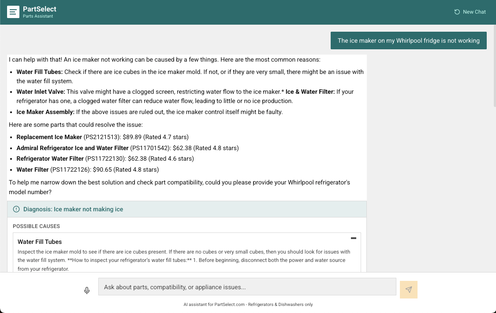
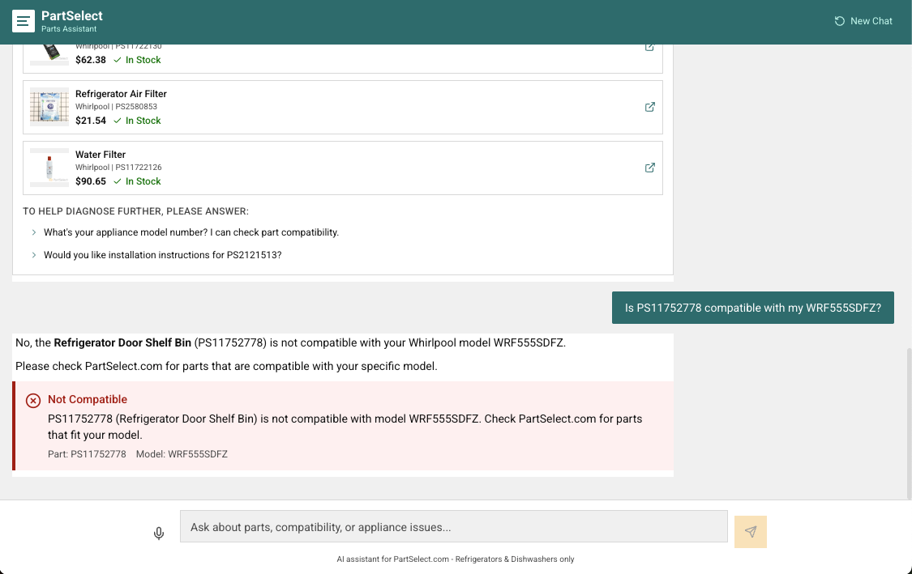
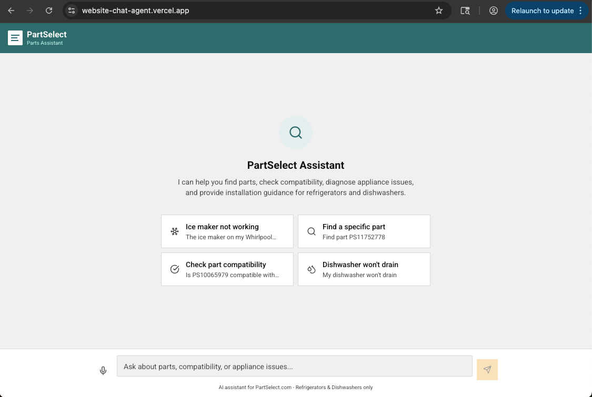
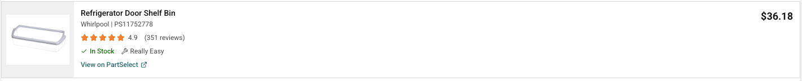
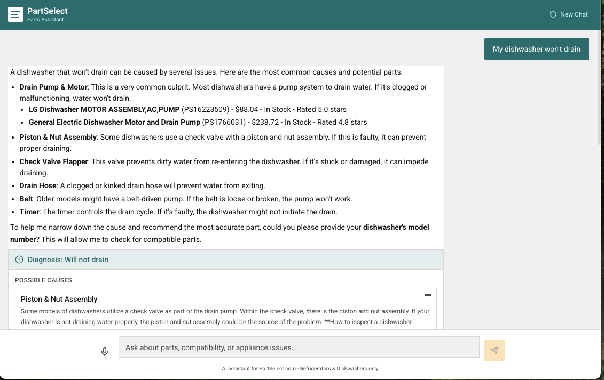
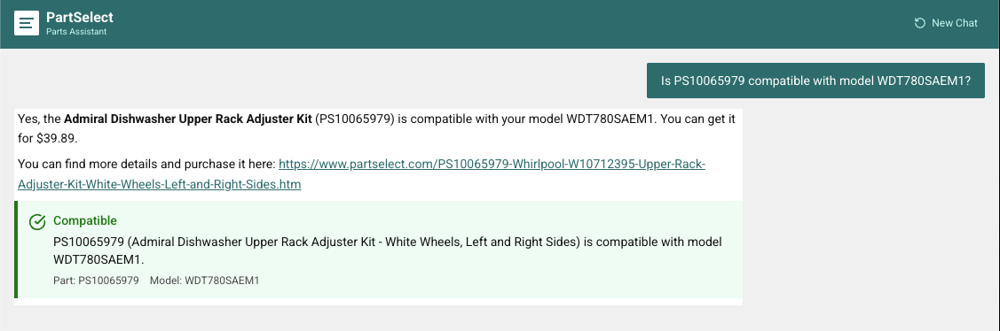
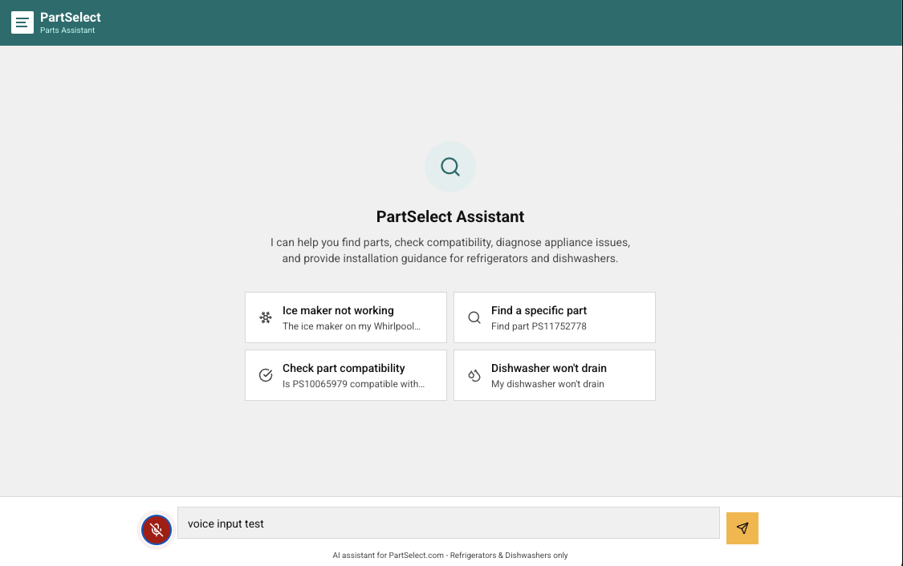
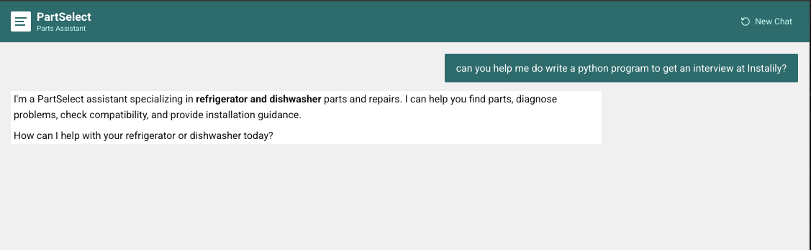

# PartSelect AI Chat Agent

An AI-powered parts assistant for PartSelect.com that uses a **custom agent loop** — not a framework wrapper — to help customers find refrigerator and dishwasher parts, diagnose symptoms, check compatibility, and get installation guidance.


<p align="center">
  
  
</p>

<p align="center">
  <a href="https://website-chat-agent.vercel.app/"><strong>Live Demo</strong></a> · <a href="docs/PartSelect_AI_Agent_v2.pdf"><strong>Presentation (PDF)</strong></a>
</p>

---

## What It Does

| Capability | Description | Example Query |
|---|---|---|
| **Part Lookup** | Hybrid semantic + keyword search across 4,170 parts with 3-tier fallback (scoped → all → not found) | *"I need a door gasket for my dishwasher"* |
| **Compatibility Check** | Verifies if a specific part fits a specific model number against 162,976 model mappings | *"Is PS11752778 compatible with WRS321SDHZ08?"* |
| **Symptom Diagnosis** | Maps symptoms to ranked causes and recommended replacement parts using 159 repair guides + 51 blog articles | *"The ice maker on my Whirlpool fridge is not working"* |
| **Installation Guidance** | Returns step-by-step instructions, difficulty rating, estimated time, and YouTube video links | *"How do I install PS10065979?"* |
| **Scope Guardrails** | Three-layer defense keeps the agent focused on refrigerators and dishwashers while gracefully handling off-topic queries | *"Can you help me fix my washing machine?"* |
| **Voice Input** | Speech-to-text via Web Speech API — hands-free queries for users mid-repair | *Tap the mic, say "my dishwasher won't drain"* |

---

## Screenshots

<table>
<tr>
<td align="center" width="33%">
<br/>
<strong>Starter Prompts</strong><br/>Guided entry points for common tasks
</td>
<td align="center" width="33%">
<br/>
<strong>Product Card</strong><br/>Price, rating, stock, difficulty, symptom tags
</td>
<td align="center" width="33%">
<br/>
<strong>Diagnosis Card</strong><br/>Ranked causes with recommended parts
</td>
</tr>
<tr>
<td align="center" width="33%">
<br/>
<strong>Compatibility Check</strong><br/>Verified badge with part/model numbers
</td>
<td align="center" width="33%">
<br/>
<strong>Voice Input</strong><br/>Mic button for hands-free queries
</td>
<td align="center" width="33%">
<br/>
<strong>Scope Guardrail</strong><br/>Polite redirect for off-topic queries
</td>
</tr>
</table>

---

## Architecture

The backend runs a **custom while-loop agent** — the LLM receives the user message plus a list of available tools, decides which to call, executes them, reads the results, and either calls another tool or streams the final answer. This handles multi-intent queries naturally (e.g., *"Is this part compatible with my model and how do I install it?"*) by chaining tool calls within a single turn, without hand-coded state machines or framework abstractions.

```
┌─────────────────────────────────────────────────────────────────┐
│                        USER (Browser)                           │
│                                                                 │
│  ┌───────────────────────────────────────────────────────────┐  │
│  │              Next.js Chat Interface                       │  │
│  │  ┌─────────┐ ┌──────────┐ ┌───────────┐ ┌────────────┐  │  │
│  │  │ Message  │ │ Product  │ │  Quick    │ │  Starter   │  │  │
│  │  │ Bubbles  │ │ Cards    │ │  Replies  │ │  Prompts   │  │  │
│  │  └─────────┘ └──────────┘ └───────────┘ └────────────┘  │  │
│  └──────────────────────┬────────────────────────────────────┘  │
└─────────────────────────┼───────────────────────────────────────┘
                          │ SSE Stream (Server-Sent Events)
                          ▼
┌─────────────────────────────────────────────────────────────────┐
│                     FastAPI Backend                              │
│                                                                 │
│  ┌───────────────────────────────────────────────────────────┐  │
│  │                   Agent Loop                              │  │
│  │                                                           │  │
│  │  User Message → LLM (Gemini 2.5 Flash)                   │  │
│  │       │                                                   │  │
│  │       ├── decides: call tool(s)?                          │  │
│  │       │     YES → execute tool → feed result back to LLM  │  │
│  │       │     NO  → stream final response                   │  │
│  │       │                                                   │  │
│  │       └── repeat until LLM produces final answer          │  │
│  └───────────────────────────────────────────────────────────┘  │
│                                                                 │
│  ┌─────────────┐ ┌──────────────┐ ┌─────────────────────────┐  │
│  │  Guardrail  │ │  Session     │ │  Streaming Response     │  │
│  │  Classifier │ │  Memory      │ │  (SSE)                  │  │
│  └─────────────┘ └──────────────┘ └─────────────────────────┘  │
└──────────────┬──────────────────────────────────────────────────┘
               │
               ▼
┌─────────────────────────────────────────────────────────────────┐
│                        Tool Layer                               │
│                                                                 │
│  ┌──────────────┐ ┌───────────────┐ ┌────────────────────────┐ │
│  │ search_parts │ │ check_compat  │ │ get_install_guide      │ │
│  │              │ │               │ │                        │ │
│  │ Semantic +   │ │ Exact model → │ │ Installation steps,    │ │
│  │ keyword      │ │ part lookup   │ │ video links, difficulty│ │
│  │ hybrid search│ │ in metadata   │ │ rating                 │ │
│  └──────┬───────┘ └───────┬───────┘ └────────────┬───────────┘ │
│         │                 │                      │             │
│  ┌──────────────────┐  ┌─────────────────────────────────────┐ │
│  │ diagnose_symptom │  │ get_product_details                 │ │
│  │                  │  │                                     │ │
│  │ Symptom → causes │  │ Full product page data for a        │ │
│  │ → recommended    │  │ specific part number                │ │
│  │ parts            │  │                                     │ │
│  └────────┬─────────┘  └──────────────────┬──────────────────┘ │
└───────────┼────────────────────────────────┼────────────────────┘
            │                                │
            ▼                                ▼
┌─────────────────────────────────────────────────────────────────┐
│                    Data Layer                                    │
│                                                                 │
│  ┌─────────────────────────┐  ┌──────────────────────────────┐ │
│  │      ChromaDB           │  │   Structured JSON Store      │ │
│  │                         │  │                              │ │
│  │  Embedded chunks:       │  │  parts.json                  │ │
│  │  - product overviews    │  │  - part_number → full data   │ │
│  │  - installation guides  │  │  - model compatibility map   │ │
│  │  - troubleshooting tips │  │  - symptom → parts map       │ │
│  │  - repair articles      │  │                              │ │
│  │                         │  │  (Fast exact lookups)        │ │
│  │  Metadata filters:      │  │                              │ │
│  │  - appliance_type       │  │                              │ │
│  │  - brand                │  │                              │ │
│  │  - chunk_type           │  │                              │ │
│  │  - part_number          │  │                              │ │
│  └─────────────────────────┘  └──────────────────────────────┘ │
│                                                                 │
│  Embeddings: Gemini Embedding (gemini-embedding-001)             │
│  768 dimensions via Matryoshka Representation Learning          │
└─────────────────────────────────────────────────────────────────┘
```

### Why a Custom Agent Loop

- **Debuggable** — The entire orchestration is ~50 lines of Python. No framework internals to trace through when something goes wrong. Every tool call, every LLM decision is logged and visible.
- **Handles multi-intent queries** — A state machine breaks on *"Is this part compatible and how do I install it?"* The agent loop handles it naturally by chaining `check_compatibility` → `get_installation_guide` in a single turn.
- **No framework overhead** — LangChain/LlamaIndex add abstraction tax that isn't justified for 5 tools + 1 LLM. A custom loop signals stronger engineering to evaluators and is trivial to explain in a Q&A.

### Why Gemini 2.5 Flash

Speed is the top priority for a chat agent. Gemini 2.5 Flash gives us the fastest time-to-first-token, highest throughput, and lowest cost — critical for a customer support chatbot where perceived speed matters enormously.

| Model | TTFT | Throughput | Function Calling | Cost (input/1M) |
|---|---|---|---|---|
| **Gemini 2.5 Flash** | **~250ms** | **~250 tok/s** | Excellent | **$0.15** |
| GPT-4.1 Mini | ~800ms | ~62 tok/s | Excellent | $0.40 |
| Claude Haiku 4.5 | ~600ms | ~79 tok/s | Good | $0.80 |

**Deep dives:** [Architecture](ARCHITECTURE.md) · [Backend Architecture](BACKEND_ARCHITECTURE.md)

---

## Tools

The LLM has access to 5 tools, each registered as a Gemini function declaration. The agent decides which to call based on the user's message.

| Tool | Trigger | What It Does |
|---|---|---|
| `search_parts` | Natural language query or part number | Hybrid semantic + keyword search with 3-tier fallback: scoped (fridge/dishwasher) → all products → helpful not-found with suggestions |
| `check_compatibility` | Part number + model number | Exact lookup against 162,976 model mappings. Returns "verified" when found, honest "not in data" caveat when not — never falsely claims incompatibility |
| `diagnose_symptom` | Symptom description + appliance type | Fuzzy-matches against 49 symptoms, searches 159 repair guides + 51 blog articles, returns ranked causes with recommended parts and source links |
| `get_installation_guide` | Part number or symptom | Returns step-by-step instructions, difficulty rating (1-5), estimated time, tools needed, and YouTube video link |
| `get_product_details` | Part number | Full product data for rich card rendering: price, rating, reviews, stock, image, compatible model count, symptoms fixed |

> Every tool includes a required **`reasoning`** parameter — the LLM must explain *why* it chose this tool and *how* it determined the inputs. This parameter isn't used by tool logic; it's a chain-of-thought forcing function that improves tool selection accuracy and creates a full audit trail for debugging.

---

## Data Pipeline

All 4,170 product pages were scraped using **Playwright with a real Chrome browser**, bypassing PartSelect's Akamai anti-bot protection. Every single part is fully enhanced with compatible models, ratings, descriptions, images, and raw markdown.

| Dataset | Count | Source | Notes |
|---|---|---|---|
| Parts | 4,170 | Playwright (Chrome) | 100% enhanced — avg 429 compatible models/part |
| Model Mappings | 162,976 | Playwright AJAX scroll | Captured full paginated model lists per part |
| Repair Guides | 159 | Playwright | 22 generic + 101 brand-specific + 36 how-to |
| Blog Articles | 51 | Firecrawl | 86,587 words — error codes, how-tos, troubleshooting |
| Vectors | ~5,107 | Gemini Embedding | 4,170 part vectors + ~937 knowledge vectors |

### Entity-Centric Embedding

Each part is embedded as a **single constructed document** — not chunked from raw HTML. One part = one vector, with no chunking artifacts or navigation noise:

```
Refrigerator Door Shelf Bin by Whirlpool. PS11752778 / WPW10321304.
$36.18, 4.9 stars (351 reviews). In stock.
This refrigerator door bin is a genuine OEM replacement...
Fixes symptoms: Door won't close, Ice or frost buildup, Leaking.
```

Scope filtering happens at **query time** via ChromaDB metadata (`appliance_type`, `brand`, `chunk_type`), not at ingestion. This means adding a new appliance type requires changing one filter value — no re-scraping, no re-embedding.

**Deep dive:** [Data Status](DATA_STATUS.md)

---

## Extensibility

### Adding a New Appliance (e.g., Washing Machines) — *1-2 hours*

Since the scraper already collected data for all appliance types:

1. Add `"washer"` to the tier-1 metadata filter whitelist in `search_parts`
2. Scrape washer-specific repair guides for the symptom database
3. Update the system prompt to include washers
4. **No re-scraping, no re-embedding, no code changes** to the agent loop or frontend

### Adding a New Tool (e.g., Order Tracking) — *Half a day*

1. Define the tool function in Python
2. Register it as a Gemini function declaration
3. Add a new SSE event type if it needs a custom UI component
4. Build the frontend component

### Swapping the LLM — *One config value*

The agent loop is model-agnostic. Tool definitions use standard JSON schema. Switching from Gemini to GPT-4.1 or Claude requires changing one config value and minor SDK adaptation. The tool layer, data layer, and frontend are completely unchanged.

---

## Tech Stack

| Layer | Technology | Why |
|---|---|---|
| Frontend | Next.js 16 + React 19 + Tailwind CSS 4 | Server components, streaming support, PartSelect brand styling |
| Backend | FastAPI + Python 3.13 | Async-native, SSE streaming via `sse-starlette`, fast startup |
| LLM | Gemini 2.5 Flash | Fastest TTFT (~250ms), highest throughput (~250 tok/s), lowest cost ($0.15/1M), excellent function calling |
| Embeddings | Gemini Embedding (768 dims) | Task-type optimization, Matryoshka dimensions, multimodal-ready |
| Vector DB | ChromaDB | Zero-config local vector store, metadata filtering, sufficient for 5K vectors |
| Scraping | Playwright (Chrome) | Bypasses Akamai anti-bot, scrolls AJAX pagination, captures full model lists |
| Streaming | Server-Sent Events (SSE) | Works through Vercel edge/CDN, auto-reconnect, simpler than WebSockets for unidirectional flow |
| Deploy | Vercel (frontend) + Docker (backend) | Free tier, edge CDN, zero-config CI/CD |

---

## Getting Started

### Prerequisites

- Python 3.13+
- Node.js 20+
- A [Gemini API key](https://aistudio.google.com/apikey)

### Quick Start

**Backend:**

```bash
cd backend
cp .env.example .env          # Add your GEMINI_API_KEY
uv sync                       # Install dependencies
uv run uvicorn app.main:app --reload --port 8000
```

**Frontend:**

```bash
cd frontend
npm install
npm run dev                   # Starts on http://localhost:3000
```

### Docker (Backend)

```bash
docker build -t partselect-backend .
docker run -p 8000:8000 -e GEMINI_API_KEY=your-key partselect-backend
```

### Run Tests

```bash
# Backend smoke tests (data loading, tool correctness, 15 tests)
cd backend && uv run python -m scripts.test_backend

# Frontend unit tests (vitest)
cd frontend && npm test
```

---

## Project Structure

```
├── frontend/
│   ├── src/
│   │   ├── app/              # Next.js app router (page, layout, API proxy)
│   │   ├── components/       # Chat UI: MessageBubble, ProductCard, DiagnosisCard,
│   │   │                     #   StarterPrompts, CompatibilityBadge, VoiceInput
│   │   ├── hooks/            # useChat (streaming), useSTT (speech-to-text)
│   │   └── lib/              # Utilities, types, constants
│   └── package.json
│
├── backend/
│   ├── app/
│   │   ├── agent/            # loop.py (while-loop orchestrator), system_prompt.py,
│   │   │                     #   classifier.py (rule-based intent guard)
│   │   ├── tools/            # search_parts, check_compatibility, diagnose_symptom,
│   │   │                     #   installation_guide, product_details
│   │   ├── data/             # loader.py, chroma_store.py, search.py (hybrid search)
│   │   ├── api/              # chat.py (SSE endpoint), models.py (Pydantic schemas)
│   │   └── main.py           # FastAPI app, CORS, lifespan
│   ├── scripts/              # embed_parts.py, embed_knowledge.py, test_backend.py
│   └── pyproject.toml
│
├── data/                     # Scraped datasets (parts, repairs, blogs, indexes)
├── ARCHITECTURE.md           # Full system architecture deep dive
├── BACKEND_ARCHITECTURE.md   # Backend implementation details
├── DATA_STATUS.md            # Data pipeline status and coverage
└── Dockerfile                # Backend container
```

---

## Guardrails

The agent stays scoped to refrigerators and dishwashers through three independent layers of defense:

1. **System prompt** (primary) — Instructs the LLM to specialize in refrigerator and dishwasher parts and politely redirect off-topic queries. Includes few-shot examples of correct tool routing.

2. **Rule-based classifier** (zero latency) — A keyword/regex classifier runs *before* the LLM call. Categorizes input as `ON_TOPIC`, `GREETING`, `OTHER_APPLIANCE`, or `OFF_TOPIC`. Off-topic queries get a canned redirect without ever hitting the LLM — zero cost, zero latency.

3. **Metadata filtering** (data-level) — ChromaDB queries in `search_parts` restrict tier-1 results to `appliance_type IN ["refrigerator", "dishwasher"]`. Even if the LLM ignores the system prompt, the data layer enforces scope.

---

## Future Roadmap

- **Image upload for visual part identification** — Gemini Embedding supports multimodal vectors; user-uploaded part photos would land in the same embedding space as product data
- **TTS read-aloud for installation guides** — Web Speech API's `SpeechSynthesis` for hands-free step-by-step guidance mid-repair
- **Order tracking tool** — Integration with order management APIs as a new agent tool
- **Part comparison side-by-side** — Compare specs, price, and compatibility across multiple parts
- **Production scaling** — Redis for session state, Pinecone for managed vector DB, Kubernetes for horizontal scaling, Vertex AI for Gemini SLAs and monitoring

---

## Documentation

| Document | Description |
|---|---|
| [Presentation (PDF)](docs/PartSelect_AI_Agent_v2.pdf) | 18-slide deck covering interface design, architecture, extensibility, and query accuracy |
| [ARCHITECTURE.md](ARCHITECTURE.md) | Full system architecture — agent loop, LLM choice, data pipeline, guardrails, extensibility |
| [BACKEND_ARCHITECTURE.md](BACKEND_ARCHITECTURE.md) | Backend implementation — tools, embedding strategy, search, streaming, session management |
| [DATA_STATUS.md](DATA_STATUS.md) | Data pipeline status — scraper details, coverage metrics, schema definitions |
| [BRANDING_BRIEF.md](BRANDING_BRIEF.md) | PartSelect brand guidelines for UI styling |

---

<p align="center">Built by <a href="https://github.com/aryamanbgupta">Aryaman Gupta</a> as a case study for <strong>Instalily AI</strong>.</p>